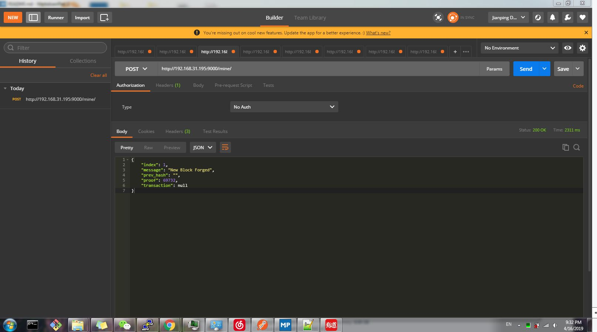
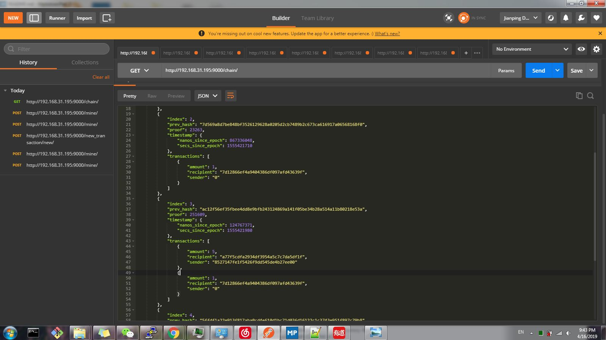
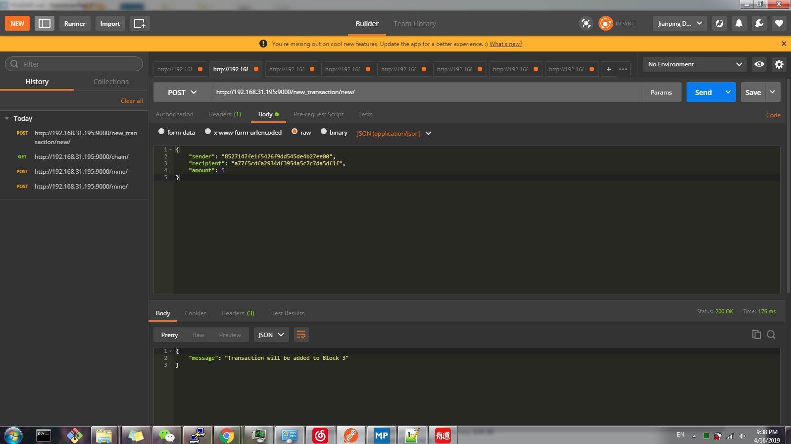
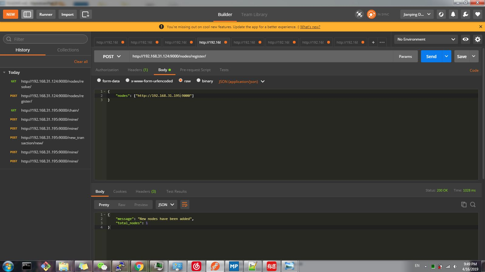
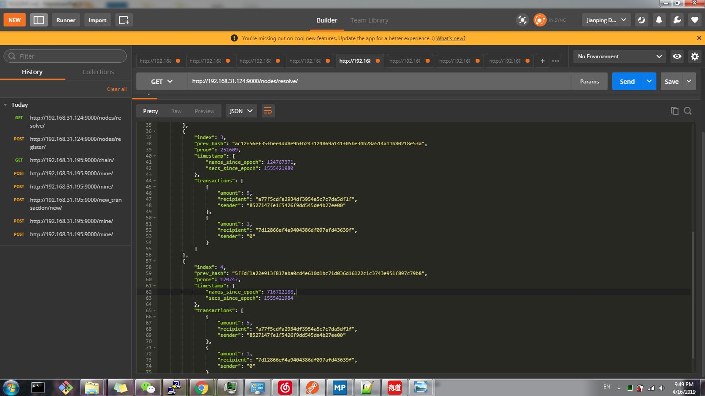

# yt-chain
[](https://travis-ci.com/Dengjianping/yt-chain)

yt-chain is just a toy of blockchain inspired by this article [Learn Blockchains by Building One](https://hackernoon.com/learn-blockchains-by-building-one-117428612f46?gi=8e1bb887685f). Originally, that's python based project, so I want to use rust to implement a one, and giving some improvements to the rust based one.


Platforms supported

- [x] Linux(including raspberry pi, aarch64, x86)
- [ ] Windows

### Stacks
- [**rust**](https://www.rust-lang.org/). A systems programming language that runs blazingly fast, prevents segfaults, and guarantees thread safety.
- [**actix-web**](https://github.com/actix/actix-web). A blazingly fast **asynchronous** web framework based on Rust.
- [**sled**](https://github.com/spacejam/sled). This is a lock-free embedded database, purely written by rust, having high performance and easy usage, etc.
- [**cuda**](https://developer.nvidia.com/cuda-downloads). A parallel computing platform and programming model that enables dramatic increases in computing performance by harnessing the power of the graphics processing unit (GPU). Use gpu to accelerate mining block instead of cpu.


### Requirements
1. Linux platform.
2. Latest stable/nightly rust.
   - If you want to run this project on raspberry pi, use nightly rust, and uncomment line 39, 40 in file **Cargo.toml** to enable "nightly" feature of sled, due to the bug [32-bit ARM compatibility](https://github.com/spacejam/sled/issues/145).
3. CUDA installed(at least 8.0, and device is capable of compute capability at least 3.5).
   - This is for accelerating mining blocks, there're some implemented encryption algorithms like sha256/384/512.
4. Cmake(at least 3.8).


### Build && Run
- Configure the yt-chain.toml file

##### CPU mining mode
If you want cpu to mine the block, use following command to build the project

```
cargo run --release
```

##### GPU mining mode
But if you want to try GPU(CUDA) to mine blocks, run the coming command.

```
cargo run --features "cuda" --release
```
These mining algorithms are optimized, no bank conflicts, aligned accessing global memory, close to 100% occupancy.
I tested it on my device([Jetson TX2](https://developer.nvidia.com/embedded/buy/jetson-tx2)), which is a pascal featured embedded device. It only has 256 CUDA cores, runs 2048 × 2 threads at a time. 

If you compile the project on desktop computer(equipped GTX series graphic card), it will run much faster than this device. Such as GTX-1080/GTX-2080 device, having 2560 CUDA cores, in theory, it should be 10x faster than my testing device at least, and the memory bandwidth is much bigger than Jetson TX2.

**Calculate 2048×100 elements at a time**

Algorithm | Time cost on kernel(cuda function)
---|---
sha256 | 1.50ms
sha384 | 3.83ms
sha512 | 3.92ms

### Usage

There're some APIs created for operate the server.

- /chain/ get the whole block chain
- /mine/ mine a new block, and add it to the block chain
- /transaction/new/ create a transaction to current block chain
- /nodes/register/ add a another block chain server to current node server
- /nodes/resolve/ get consensus with the registered node server


##### Mining.



##### Get the whole blockchain.



##### Transaction.




Before this operation, start a another node server.

##### Register a node



##### Consensus.

